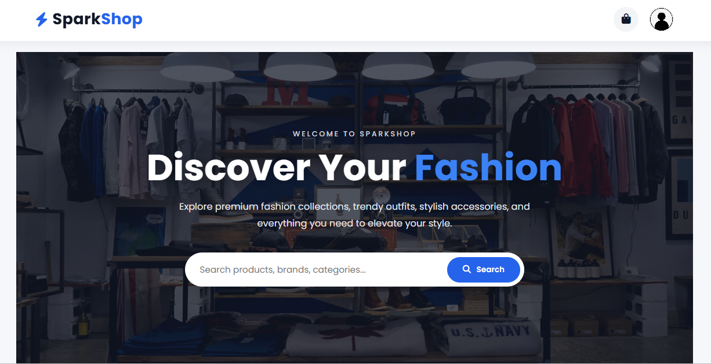
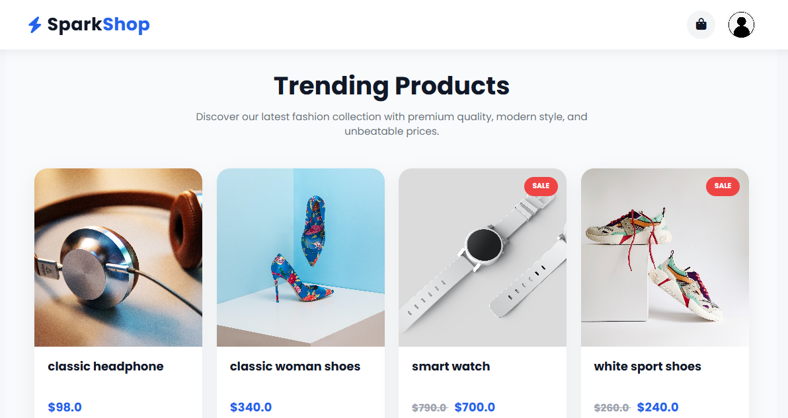
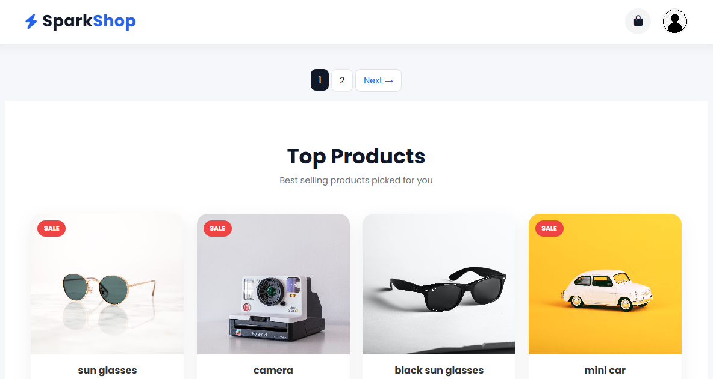
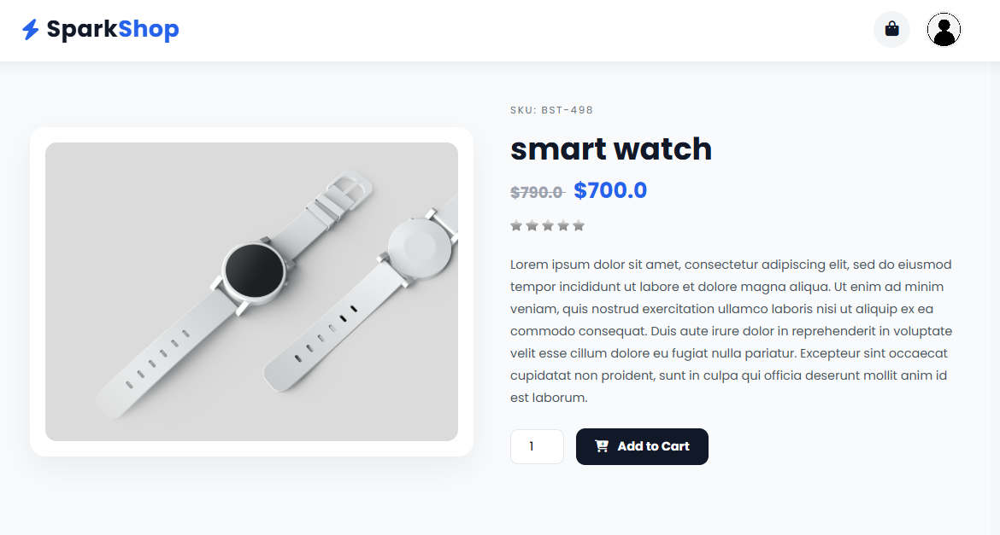
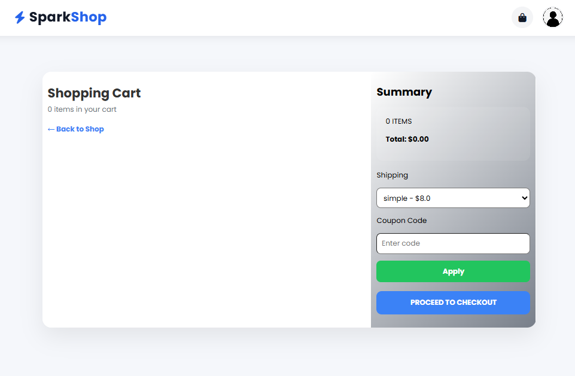
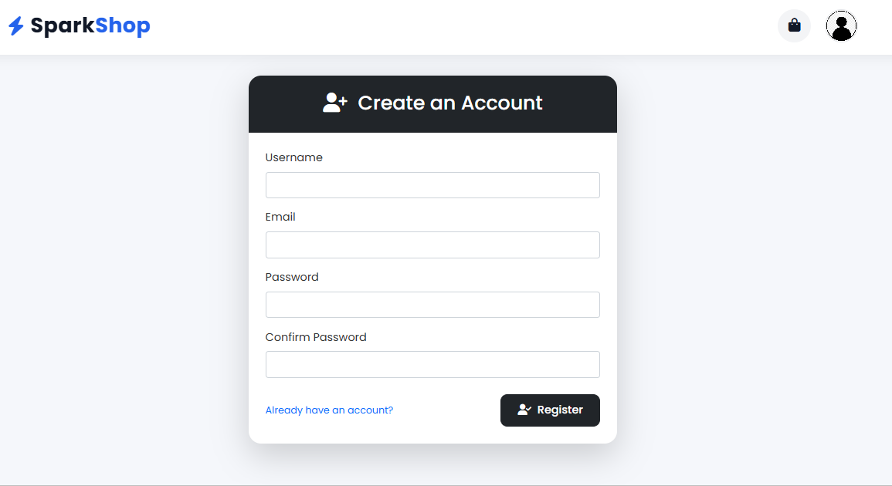
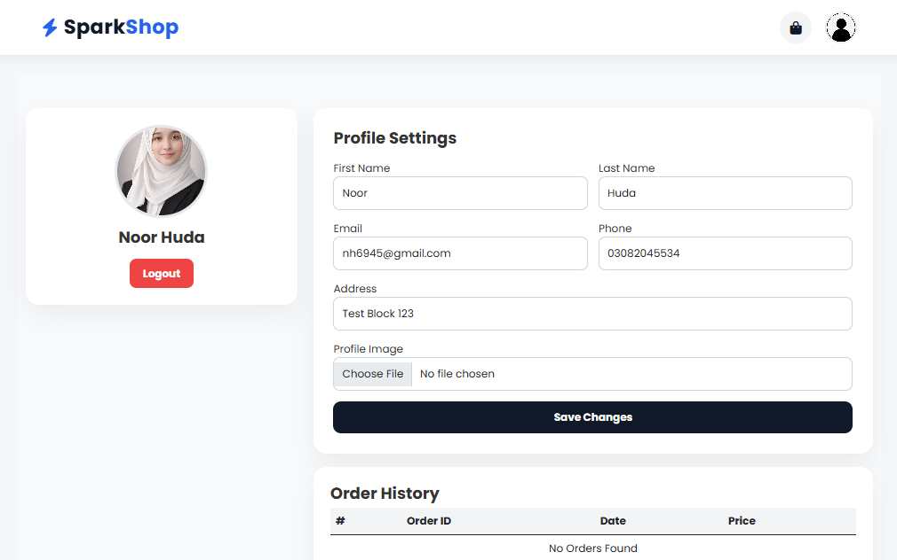
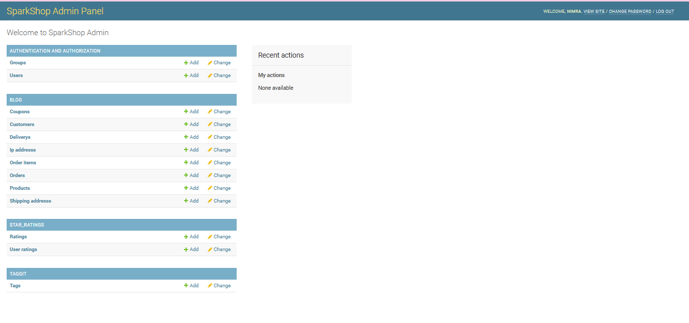

<div align="center">

# 🛍️ SparkShop – Django E-Commerce Platform


<br><br>

🚀 A modern Django-based eCommerce web application with cart, authentication & admin panel.

<br><br>

<a href="https://github.com/Noor-Huda-dev/sparkshop">
  
</a>

</div>

---

## ✨ About The Project

SparkShop is a full-stack **Django eCommerce platform** built for learning and portfolio purposes.

It provides a smooth shopping experience with modern UI and backend functionality.

---

## ⚙️ Tech Stack

- 🐍 Python  
- 🎯 Django  
- 🗄️ SQLite  
- 🎨 HTML, CSS, Bootstrap  
- ⚡ JavaScript  

---

## 🚀 Features

- 👤 User Authentication (Login/Register)
- 🛒 Shopping Cart System
- 🛍️ Product Listing & Details
- 🔥 Trending & Top Products
- 🙍 User Profile System
- 🛠️ Admin Dashboard
- 📱 Fully Responsive Design

---

## 📸 Screenshots

### 🏠 Home Page


### 🔥 Trending Products


### ⭐ Top Products


### 🛒 Product Detail


### 🧺 Shopping Cart


### 👤 Registration


### 🙍 User Profile


### 🛠️ Admin Dashboard


---

## 📁 Project Structure
```bash
sparkshop/
│
├── screenshot_sparkshop/
│ ├── home.png
│ ├── detailproduct.png
│ ├── shoppingcart.png
│ ├── admindeshboard.png
│ ├── userprofile.png
│ ├── trandingproduct.png
│ ├── toppro.png
│ └── Reagistration.png
│
├── manage.py
├── db.sqlite3
└── requirements.txt
```
---

## ⚙️ Installation

```bash
git clone https://github.com/your-username/sparkshop.git
cd sparkshop

python -m venv venv

# Windows
venv\Scripts\activate

pip install -r requirements.txt

python manage.py migrate
python manage.py runserver
```

## 🔐 Admin Access

```bash
python manage.py createsuperuser
```
URL: /admin
---

### Noor Huda
💻 Django Developer • React.js Developer • AI/ML Enthusiast
